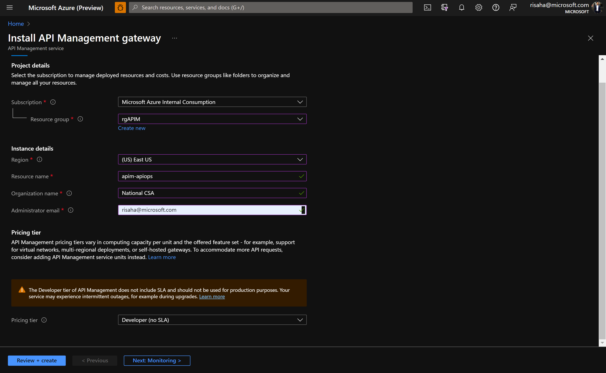

## Create an API Management instance

We will need to create two APIM instances to demonstrate promotion of configurations (e.g. different policies, name/value pairs) across different environments. In this workshop we will simulate promotion from Dev -> Prod, but in an enterprise scenario you can expand it to have one or more stages between the Dev and Prod Environments. 

An instance can take some time to provision. Expect ~45-75 minutes. Therefore, please create both instances prior to any demo.

Using either your own or [Azure's common naming convention](https://docs.microsoft.com/en-us/azure/cloud-adoption-framework/ready/azure-best-practices/resource-naming), fill in each required field and press *Review + Create*, followed by *Create* to provision the service. Once started, it is not necessary to remain on this page or in the Azure Portal. If you entered a valid email address, you will receive a provisioning completion email.

Please note that the **service name must be unique**. We recommend to include your initials and numeric date. Also we recommend that you add -prod in the name of the production instance to easily identify it in your DevOps scripts and configuration files. For example in the image below the prod instance would be called apim-apiops-prod.

> Take note of both APIM service names as you will need them for forming URLs in this lab.

Please use the **Developer** tier, which provides [all relevant features at the lowest cost](https://azure.microsoft.com/en-us/pricing/details/api-management/#pricing). 

