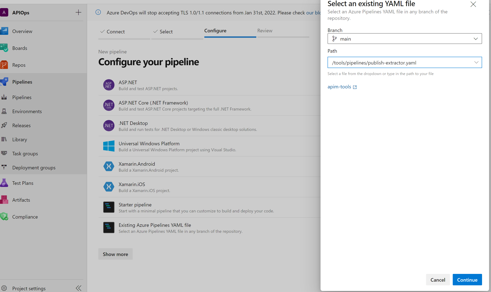

## Configure APIM tools in Azure DevOps

1. Create a new project in Azure DevOps for this tutorial (optional). We will refer to it as **apiops** in this tutorial
2. Publish the [**tools**](../../../tools/) folder to this new repository. Your folder structure should look like:
    - your-repo-name
        - tools
            - code
                - ...
            - pipelines
                - ...
            - utils
3. [Create an Azure Artifacts feed](https://docs.microsoft.com/en-us/azure/devops/artifacts/concepts/feeds?view=azure-devops#create-a-feed). We will use the name **apim-tools** in this tutorial.

4. [Create a pipeline variable group](https://docs.microsoft.com/en-us/azure/devops/pipelines/library/variable-groups?view=azure-devops&tabs=classic#create-a-variable-group) called **apim-automation**. In that group, add these variables:
    - **ARTIFACTS_FEED_NAME** and for its value, enter the name of the artifacts feed you just created.
    - **SERVICE_CONNECTION_NAME** and for its value, enter the name of your [Azure service connection](https://docs.microsoft.com/en-us/azure/devops/pipelines/library/service-endpoints?view=azure-devops&tabs=yaml).
    - **RESOURCE_GROUP_NAME** and for its value, enter the resource group name of your Azure APIM instance. In this workshop we have two apim instances representing both the dev and prod environments so make sure you have two resource group entries representing both as shown in the image below.

5. Create a target [**environment**](https://docs.microsoft.com/en-us/azure/devops/pipelines/process/environments?view=azure-devops) called prod as shown below. The environment will allow us to require a manual approval between stages in a yaml based release pipeline. Choose Prod as the name and for the resource type choose None. 
6. After creating the environment add one ore more approvers by heading to the ellipses menu and click on "Approvals and checks" 
7. Here we are adding a single approver but in an enterprise setting its recommended that you add two or more approvers. 
8. Create a new pipeline based on [**publish-extractor.yaml**](../../../tools/pipelines/publish-extractor.yaml). This pipeline will compile the extractor tool whenever it's updated and publish it as a package in Azure DevOps Artifacts.

9. Run the pipeline.
10. Create a new pipeline based on [**publish-publisher.yaml**](../../../tools/pipelines/publish-publisher.yaml). This pipeline will compile the publisher tool whenever it's updated and publish it as a package in Azure DevOps Artifacts.
11. Run the pipeline.