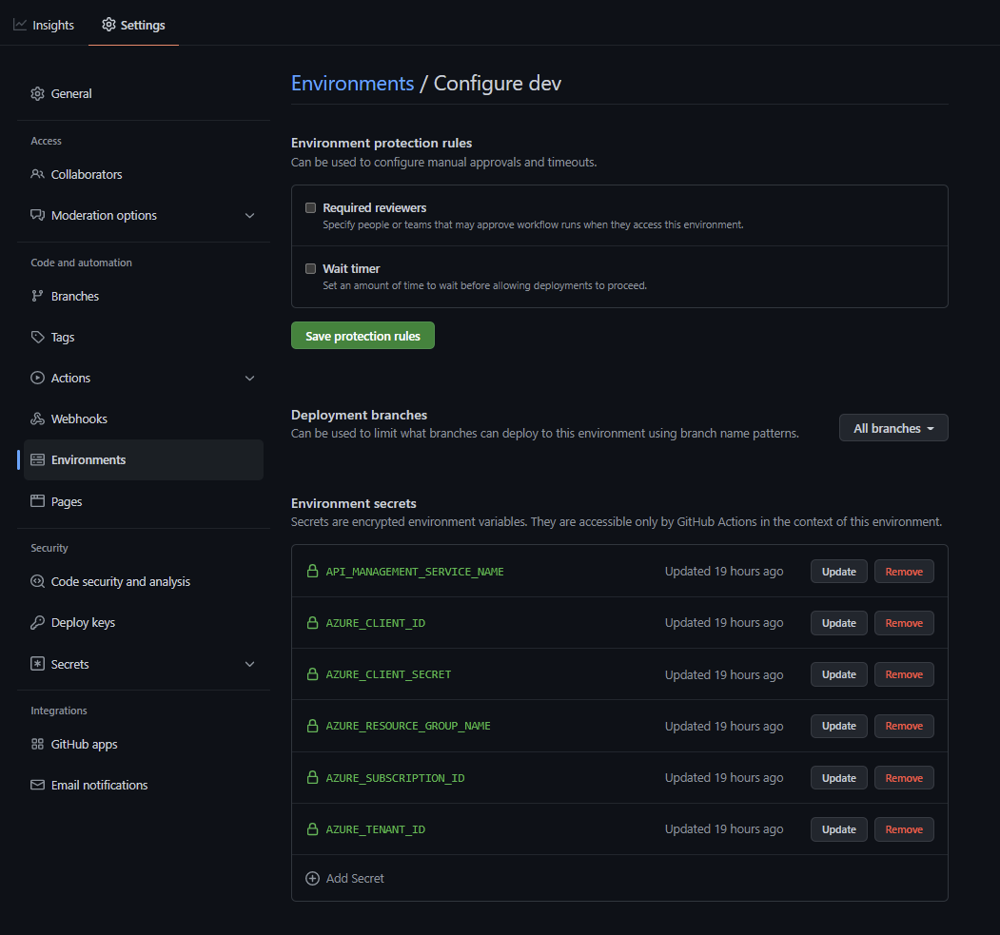
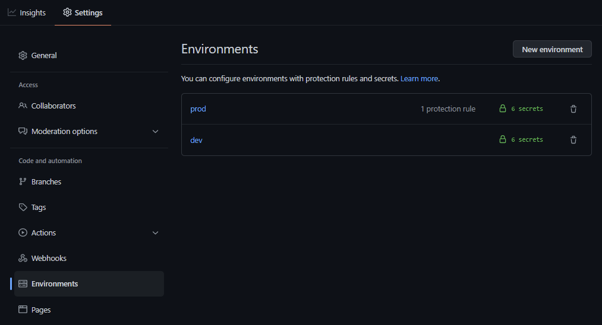

> **Note**
> Please note that the instructions on this page pertain to new and simplified setup which was introduced with release v3.0.0
 
The older setup [can be found here](https://azure.github.io/apiops/apiops/3-apimTools/apimtools-github-2-4-new.html).
 
> **Note**
> Starting with release v4.0.0 both windows and linux build agents are supported. Thus you will notice that starting with v4.0.0 there are separate binaries (extractor and publisher) get generated for each OS.

## Configure APIM tools in GitHub

1. Create a new Github repository. We will refer to it as **apiops** in this tutorial.
2. Head to the release you are targeting on the Github page. The list of releases can be found [here](https://github.com/Azure/apiops/releases). For this example we will assume you are trying to start with release v.3.0.0.  As you can see in the image below under the "Assets" section you have a file called **Github.zip**. Download that file and then extract the content into your repository. Your folder structure should look like:
    - your-repo-name
        - .github
            - workflows

    
    In order to update the pipelines in the future you will follow the same steps documented in step 2.
3. Next we will need to [Create an Azure AD Service Principal](https://docs.microsoft.com/en-us/cli/azure/ad/sp?view=azure-cli-latest#az-ad-sp-create-for-rbac) and configure its access to Azure resources. We will provide the SP with the contributor role to the resource groups hosting your different APIM instances. Make sure that you have the [Azure CLI](https://docs.microsoft.com/en-us/cli/azure/install-azure-cli) installed. Issue the following command twice on your command prompt (once for each environment). Make sure you replace the subscription id and resource group with your own information.
     - az ad sp create-for-rbac -n "apiopslab" --role Contributor --scopes /subscriptions/{subscription-id}/resourceGroups/{dev-resource-group} --sdk-auth
    - az ad sp create-for-rbac -n "apiopslab" --role Contributor --scopes /subscriptions/{subscription-id}/resourceGroups/{prod-resource-group} --sdk-auth
    - The output of the above az cli commands will be a json object as the one shown below. In the next step we will extract the four properties highlighted within the red box and and store them as secrets within each of your github repository environments. Note that for this guide we will create two Github [environments](https://docs.github.com/en/actions/deployment/targeting-different-environments/using-environments-for-deployment), but in an enterprise setting you will probably have more environments between dev and production (e.g. QA). 
4.  To create an environment you will need to head to the settings menu in your Github repository and crete an environment called dev. Then add 6 secrets (4 from the command you issued above in addition to the apim instance name and resource group). Make sure to use the same names shown below as they will be referenced within the different workflows. 
5. Repeat the same process for the production apim instance (remember to use the information from the json object generated for the production apim instance in the service principal command above). Also for hte production environment we will need to add a protection rule to ensure that the production stage only gets triggered after manual approval. Here is the completed production environment settings with one reviewer selected. Its recommended you have at least two approvers in an enterprise setting. 
6. Here are the two completed environments: 

7. If you open the **.github/workflows/run-extractor.yaml** and the **.github/workflows/run-publisher-with-env.yaml** files your will notice that the current release is set in an environment variable called **apiops_release_version**. You can use a secret variable instead if you would like to set it up in once place, but we felt that the secret would obscure the current version and would make it hard to track which version you are currently on. Feel free to experiment with other methods where you can simply store the release version in one location and parse it in both workflows.
8. Thats it. You are now ready to extract and publish your Azure APIM instance artifacts. Refer to the extract and publish APIM artifacts sections for more information. For a list of supported artifacts refer to [this section ](https://azure.github.io/apiops/apiops/7-additionalTopics/apiops-7-3-supportedresources.html).
