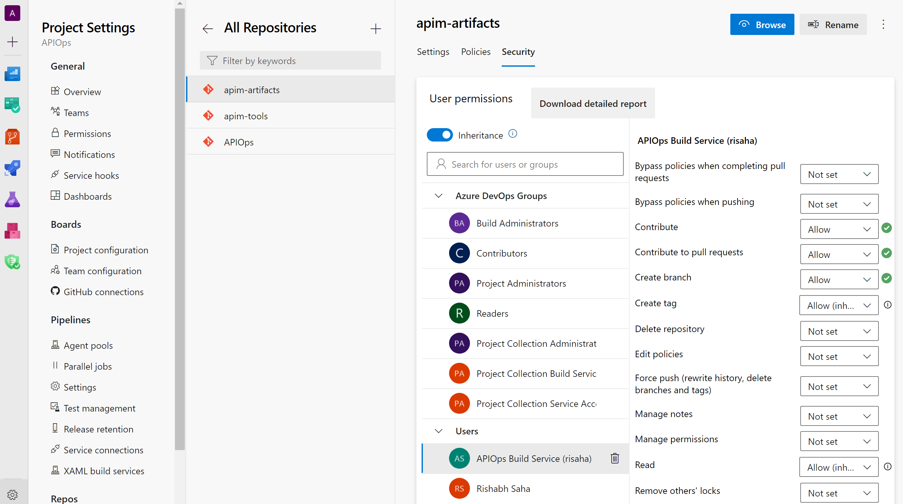
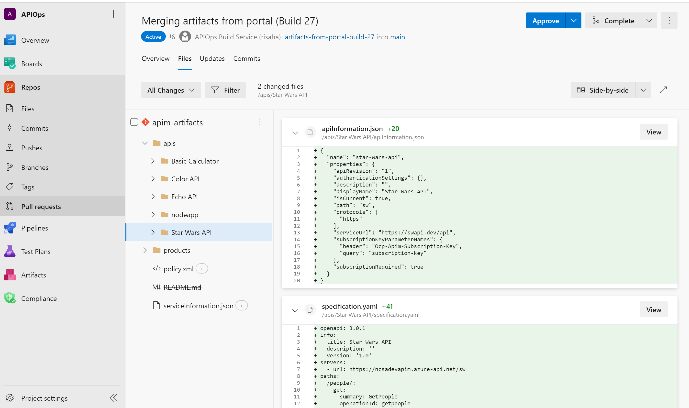

## Create APIM artifacts in Azure DevOps from extractor tool

1. Create a new repository in Azure DevOps to hold the instance artifacts. We'll refer to this as **apim-artifacts** in this tutorial.
2. Give the Azure DevOps build service permissions on this repository. To do so, go to **Project settings** -> **Repositories**. Select your repository, click on the **Security** tab, and under **Users** you should see a user called **[project-name] Build Service ([organization-name])**. Select it, then set the following permissions to **Allow**:
    - Contribute
    - Contribute to pull requests
    - Create branch

3. Make sure the Azure DevOps service principal has read access to your Azure APIM instance.
4. Create a new pipeline based on [**run-extractor.yaml**](https://github.com/Azure/apiops/tree/main/tools/pipelines/run-extractor.yaml) in your **apim-tools** repository.
5. Run the pipeline. When prompted for parameters, specify the instance name, resource group name, the APIM artifacts repository name (**apim-artifacts** in this tutorial), and the main branch where artifacts will live. The pipeline will use the extractor tool to download instance artifacts, then it will create a pull request to the main branch of your APIM artifacts repository.
> If this is your first time running this pipeline, you may be prompted to [authorize access](https://docs.microsoft.com/en-us/azure/devops/pipelines/repos/multi-repo-checkout?view=azure-devops#why-am-i-am-prompted-to-authorize-resources-the-first-time-i-try-to-check-out-a-different-repository) to the **apim-tools** repository.
6. Go to your **apim-artifacts** repo. Under **Pull requests** -> **Active**, you should see a new pull request with the extracted artifacts. Review the changes, and once you're happy with them, complete the PR.

You can always rerun the pipeline to refresh your repository with the latest Azure changes. Now that we have artifacts in our repository, let's create a pipeline to push changes back to Azure.
